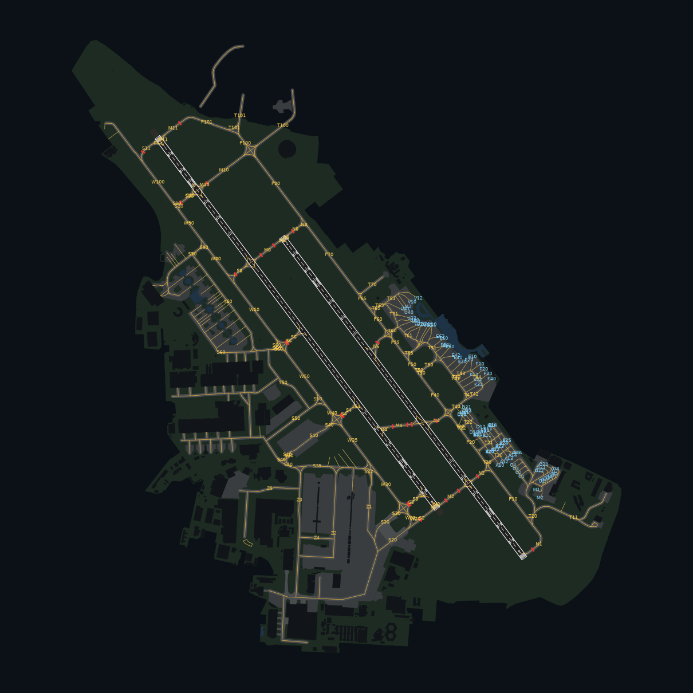

# LFBO Toulouse-Blagnac : plateforme Aurora (IVAO) et modèle 3D

Plateforme sol complète de l'aéroport de Toulouse-Blagnac pour **Aurora**, le client ATC d'IVAO, plus un **modèle 3D** de l'aéroport (glTF) et une visionneuse 3D. Tout est généré à partir des données OpenStreetMap par un script unique.

> **À savoir :** Aurora affiche en 2D (radar et plateforme sol) et ne sait pas afficher de modèle 3D.
> Ce qu'Aurora affiche pour LFBO, c'est la plateforme sol ci-dessous (vues TWR/SOL). Sur IVAO, la vue 3D depuis la tour passe par un simulateur connecté en mode tour : le décor 3D est alors celui du simulateur.
> Le modèle 3D fourni ici (`3d/LFBO.glb`) se regarde dans la visionneuse incluse, Blender ou tout lecteur glTF.



## Contenu

| Fichier | Rôle |
|---|---|
| `aurora/LFBO.isc` | Secteur de test autonome (LFBO seul) |
| `aurora/Include/LFBO/LFBO.tfl` | Polygones remplis : emprise, aires de trafic, taxiways, pistes, marquages de piste, bâtiments |
| `aurora/Include/LFBO/LFBO.geo` | Lignes : axes taxiways (`TAXI_CENTER`), contours de piste (`RUNWAY`), barres d'arrêt (`STOPBAR`) |
| `aurora/Include/LFBO/LFBO.apr` | Lignes d'entrée des postes de stationnement (`APRON`) |
| `aurora/Include/LFBO/LFBO.gts` | 81 postes de stationnement nommés |
| `aurora/Include/LFBO/LFBO.txi` | 111 étiquettes de taxiways |
| `aurora/Include/LFBO/LFBO.apt` | Ligne `[AIRPORT]` (499 ft, TA 5000 ft) |
| `aurora/Include/LFBO/LFBO.rw` | Ligne `[RUNWAY]` des deux pistes |
| `3d/LFBO.glb` | Modèle 3D : sol, marquages, 379 bâtiments extrudés, tour de contrôle, balisage lumineux |
| `3d/LFBO-3D.html` | Visionneuse 3D en un seul fichier (2,2 Mo) : s'ouvre par double-clic, sans connexion |
| `tools/generate_lfbo.py` | Générateur de tous les fichiers ci-dessus |
| `tools/vendor/` | three.js et polices intégrés à la visionneuse (licences dans `tools/vendor/README.md`) |

Ce qui est modélisé :

- pistes 14L/32R (3029 × 45 m) et 14R/32L (3502 × 45 m), avec marquages OACI : bandes de seuil, numéros, zone de toucher des roues, points de visée, axe, bandes latérales
- 235 tronçons de taxiway, 28 barres d'arrêt aux points d'attente piste
- aires de trafic (aérogares, fret, aviation d'affaires, zones Airbus)
- 123 postes de stationnement (81 nommés : A, B, C, D, E, F, G, K, M, U, V)
- aérogares Halls A à D, hangars, tour de contrôle

## Installation dans Aurora

### Option A : tester LFBO seul

1. Copier `aurora/LFBO.isc` dans `Aurora/SectorFiles/`.
2. Copier le dossier `aurora/Include/LFBO/` dans `Aurora/SectorFiles/Include/` (on obtient `Aurora/SectorFiles/Include/LFBO/LFBO.tfl`, etc.).
3. Dans Aurora, ouvrir le secteur `LFBO` et zoomer sur l'aéroport.

### Option B : ajouter la plateforme à votre secteur France

1. Repérer le dossier d'include du secteur (6ᵉ ligne de la section `[INFO]` du `.isc`, par exemple `Include/XXXX`).
2. **Sauvegarder** les fichiers `LFBO.*` déjà présents dans ce dossier, puis copier `LFBO.tfl`, `LFBO.gts`, `LFBO.txi`, `LFBO.apr` et `LFBO.geo` dans l'un des dossiers listés sur cette ligne.
3. Si `LFBO.geo` n'est pas encore déclaré, ajouter `F;<dossier>\LFBO.geo` sous `[GEO]`.
4. LFBO doit figurer dans `[AIRPORT]` (c'est déjà le cas dans le secteur France). Les fichiers `.tfl`, `.gts`, `.txi` et `.apr` sont chargés automatiquement.

IVAO met à jour les secteurs automatiquement : une mise à jour peut écraser vos fichiers locaux. Pour que tout le monde en profite, proposez-les à l'équipe secteurs d'IVAO France.

Les couches polygones portent les filtres Aurora `APRON`, `TAXIWAY`, `RUNWAY` et `BUILDING` : elles s'affichent ou se masquent avec les boutons correspondants. Les lignes utilisent les couleurs standard (`TAXI_CENTER`, `STOPBAR`, `RUNWAY`, `APRON`) et suivent donc votre schéma de couleurs.

## Modèle 3D

- **Visionneuse** : double-cliquer sur `3d/LFBO-3D.html` (Chrome, Edge, Firefox ou Safari). Le modèle, three.js et les polices sont dans le fichier : aucune connexion n'est nécessaire. Vues : vigie (œil de la tour, regard libre et « jumelles » à la molette), vue d'ensemble, aérogares, finales des 4 QFU sur un plan à 3°. Mode nuit avec balisage lumineux.
- **Blender** : Fichier › Importer › glTF 2.0, puis choisir `3d/LFBO.glb`. Axes glTF : X = Est, Y = haut, −Z = Nord, origine au point 43°38'06"N 001°22'04"E, unités en mètres.
- **Vue tour dans un simulateur** : œil de la vigie d'après OSM, environ N43°38'06.6" E001°22'04.3", 37 m sol, soit environ 619 ft AMSL.

## Régénérer

```bash
cd ivao/LFBO/tools
pip install -r requirements.txt
python generate_lfbo.py            # télécharge les données OSM à jour (cache dans .osm-cache/)
python generate_lfbo.py --offline  # régénère depuis le cache
```

Les réglages (couleurs, largeurs de taxiway, déclinaison) sont en tête du script.

## Limites

- Données **OpenStreetMap** (septembre 2026), pas l'AIP : vérifier les noms de postes et de taxiways sur la carte VAC / ADC en vigueur.
- Largeur des taxiways fixée à 23 m (15 m pour les voies de circulation d'aire) : OSM ne la renseigne pas à LFBO.
- Hauteurs de bâtiments estimées : nombre d'étages OSM × 3,5 m, sinon 18 m pour un hangar, 14 m pour une aérogare, 8 m pour le reste.
- QFU calculés avec la déclinaison WMM2025 au 1ᵉʳ octobre 2026 (+1,9° E) : 141°/321°. Comparer avec l'AIP avant de s'en servir comme référence.
- Altitude de seuil simplifiée à 499 ft pour les quatre seuils.
- Pas de SID/STAR, de fréquences ni de positions ATC : le secteur France d'IVAO les fournit déjà.
- Fichiers vérifiés par rapport à la documentation officielle des secteurs Aurora et aux conventions du secteur IVAO UK, et relus par un rendu indépendant (image ci-dessus). Ils n'ont pas été chargés dans Aurora lui-même.

Usage simulation uniquement : ne pas utiliser pour la navigation réelle.

## Licence des données

Données © [contributeurs OpenStreetMap](https://www.openstreetmap.org/copyright), sous licence [ODbL 1.0](https://opendatacommons.org/licenses/odbl/). Les fichiers générés sont une base de données dérivée : conservez la mention OpenStreetMap et redistribuez-les sous la même licence.
